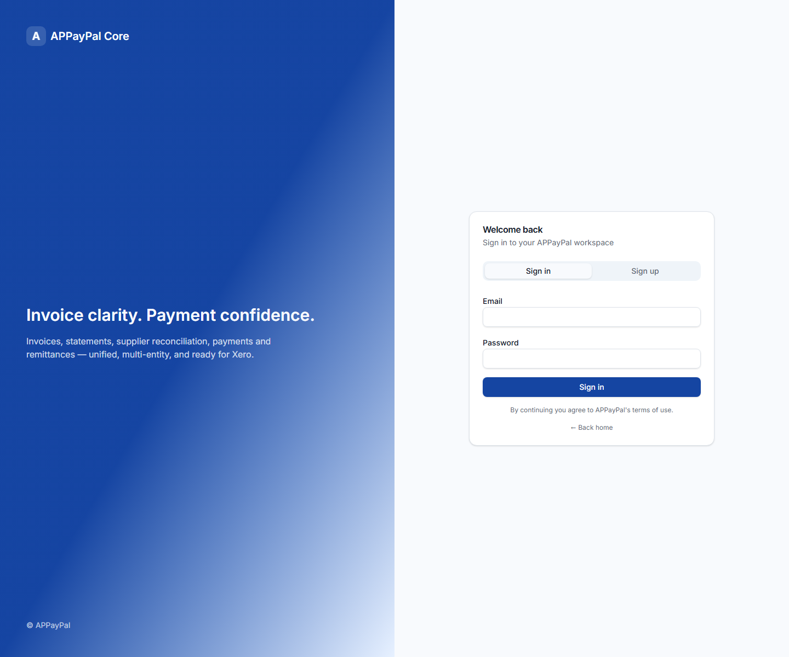

# APPayPal User Manual

This manual is for everyday APPayPal users who capture documents, review bookkeeping work, reconcile bank activity, issue customer invoices, and check reports. It explains the visible workflows in plain language and avoids technical setup detail unless it affects what a user sees on screen.

Screenshots are stored in `docs/user-manual/screenshots/`. The image links below use stable filenames so the screenshots can be captured from a live demo account and dropped into place.

## Getting Started

### Sign in

1. Open the APPayPal web app.
2. Sign in with your email address and password.
3. If you belong to more than one organisation, select the organisation you want to work in.
4. Confirm that the organisation name in the navigation matches the books you intend to update.

### Navigation

APPayPal is organised around daily bookkeeping areas:

- Dashboard: daily work queues, go-live checklist, and bookkeeping health.
- Supplier: supplier invoices, receipts, suppliers, payments, and supplier records.
- Customer: customers, sales invoices, receipts, statements, and collections.
- Bank/Cash: bank accounts, bank statement uploads, transaction review, and posting.
- Inventory, Assets, and Liabilities: operational accounting modules where enabled.
- Reports: financial and VAT reports.
- Settings/Admin: organisation settings, accounting periods, integrations, and chart of accounts.

Some menu items may show as "Soon" or be disabled. Those areas are not active for normal use yet.

### Roles and permissions

Your role controls what you can view or change.

- Owner/Admin: can manage organisation settings, users, integrations, and accounting controls.
- Accountant: can perform normal bookkeeping work such as reviewing, posting, and reconciling.
- Reviewer: can review assigned documents where enabled.
- Viewer/Client: can usually view information but not change accounting records.

If a button is missing or a save action is blocked, your role may not have permission for that action.

## Dashboard and Command Centre

The Dashboard is the first place to check what needs attention. It brings together work queues and setup checks so users do not need to hunt through every menu.

Use it to answer:

- Which invoices need review?
- Which bank transactions are unreconciled?
- Are there failed extractions or missing mappings?
- Is the organisation ready to go live?
- Are there overdue customer or supplier items?

### Daily workflow

1. Open Dashboard.
2. Review the Command Centre counts.
3. Start with failed or blocked items because they can prevent reports from being complete.
4. Work through invoice review, bank reconciliation, and customer/supplier follow-ups.
5. Return to the Dashboard to confirm the queue counts have reduced.

### Go-live checklist

The go-live checklist highlights setup items that should be complete before relying on reports. Typical items include organisation details, chart of accounts, opening balances, bank accounts, lock dates, and module settings.

When an item has a link, select it to go directly to the screen where it can be fixed.

## Supplier Invoices and Receipts

Supplier invoices and receipts are captured into APPayPal, extracted by the system, reviewed by a user, and then posted when ready.

### Upload documents

1. Open Supplier, then Invoices / Receipts.
2. Drag files into the upload area, or select the upload area and choose files from your computer.
3. Wait for the files to appear in the invoice list.
4. Check the processing status.

Supported source documents may include PDFs and images. The original document remains available for review, while APPayPal extracts supplier, date, invoice number, VAT, totals, line items, and banking details where possible.

### Understand processing status

Common statuses include:

- Pending or queued: the file is waiting to be processed.
- Processing: APPayPal is reading the document.
- Completed or ready for review: extraction has finished and the document can be checked.
- Needs review: APPayPal found something that requires user attention.
- Failed: extraction did not complete successfully.

If a document fails, open it if possible and use the troubleshooting section before uploading a duplicate.

### Review extracted data

1. Open a document from the invoice list.
2. Compare the document preview with the extracted fields.
3. Correct any supplier name, invoice number, date, VAT, subtotal, total, or banking fields that are wrong.
4. Save changes.
5. Approve the document when the information is correct.

### Review line items

1. Open the Line items tab.
2. Check each line description, quantity, unit price, VAT, and total.
3. Add, edit, or remove lines if the extraction missed details.
4. Save line items.
5. Confirm that the calculated total agrees with the source document.

APPayPal treats line items as the source for subtotal, VAT, and total where line item review is active. If totals do not agree, the document should remain in review until corrected.

### Review banking details

Use the Banking tab to compare the bank details found on the document with the supplier master record.

1. Open the Banking tab.
2. Review the bank name, account number, branch code, and related fields.
3. If the invoice details are correct but the supplier record is missing them, update the supplier record.
4. If the invoice details are wrong, override them on the document and save.

Banking mismatches should be resolved before payment.

### Link or create a supplier

If APPayPal can identify the supplier, the document may already be linked to a supplier record. If not:

1. Open the Supplier tab on the invoice review screen.
2. Select a suggested supplier, search for an existing supplier, or create a supplier from the extracted information.
3. Confirm the supplier record before approval.

## Suppliers

Supplier records hold the master information used for invoice review, banking checks, VAT handling, and payment readiness.

### Maintain supplier details

1. Open Supplier, then the supplier management screen.
2. Search for the supplier.
3. Open the supplier record.
4. Review trading name, VAT number, contact details, addresses, and banking details.
5. Save any changes.

Good supplier records reduce invoice review time because APPayPal can compare extracted information against trusted master data.

### Supplier branches

Where a supplier has multiple branches, use branch records to keep location-specific details separate. This is useful when invoices from different branches carry different delivery addresses, account codes, or banking references.

### KYC and supplier readiness

If KYC screens are enabled, use them to request, track, and review supplier documents. Suppliers with missing banking or KYC information may appear as not ready for payment.

### Allocation rules

Supplier allocation rules help APPayPal suggest the correct expense account or tracking treatment for future invoices. Use them when a supplier's invoices normally belong to the same account or department.

Each rule contains one or more allocation splits whose percentages must total 100%. A split selects an expense account, optional tracking values (for example Company Division), and an optional VAT treatment. Leaving VAT treatment unset inherits the selected account's VAT treatment. Full VAT is claimed when the supplier is VAT registered; blocked VAT is added to the expense; zero-rated and exempt splits receive no VAT.

The allocation-rule editor loads its choices from `GET /api/suppliers/{supplier_id}/allocation-rule-options?organisation_id={organisation_id}`. The response contains active `tracking_dimensions` with their active values, the supported `vat_treatments`, and active accounts with their default VAT treatment. Rule create and update payloads store `tracking` as a dimension-ID to value-ID map and `vat_treatment` on each split.

## Bank/Cash

The Bank/Cash area is used to create bank accounts, upload bank statements, review extracted transactions, and post balanced journals.

### Add a bank account

1. Open Bank/Cash, then Bank.
2. Select the option to create a bank account.
3. Enter the account name, bank, account number, currency, and opening balance information.
4. Link the bank account to the correct general ledger account where required.
5. Save the bank account.

The GL account link is important because posted bank journals use it in the accounting reports.

### Upload a bank statement

1. Open the bank account.
2. Upload the statement file.
3. Confirm the upload appears in the statement upload list.
4. Start extraction if it does not begin automatically.
5. Review any extraction warnings or duplicate notices.

APPayPal keeps the original file and imports the extracted transaction lines separately for review.

### Review bank transactions

1. Open an unreconciled transaction.
2. Check the date, description, reference, and amount.
3. Choose the correct action:
   - Match to an invoice or receipt when APPayPal finds a likely document.
   - Allocate to a GL account when there is no matching document.
   - Split the transaction if it belongs to multiple accounts.
   - Skip or mark for later only when appropriate.
4. Review VAT and tracking details.
5. Save the review.

### Create and post journals

After a bank line is reviewed, APPayPal can create a draft journal and post it.

1. Preview the journal if the option is available.
2. Confirm the debit and credit lines are correct.
3. Post the journal.
4. Check reports using the correct date range.

Posted bank journals should appear in the General Ledger, Trial Balance, and related reports when the report date range includes the transaction date.

### Bank rules

Bank rules help APPayPal recognise repeat transactions. After reviewing a transaction, save a rule when the same description or reference should usually be allocated in the same way.

Rules should be reviewed occasionally to confirm they are still correct.

## Customers and Sales Invoices

The Customer area is used to manage customer records, create sales invoices, issue them, record receipts, and follow up outstanding balances.

### Create or update a customer

1. Open Customer, then customer management.
2. Create a new customer or open an existing one.
3. Enter contact details, billing details, VAT information, and payment terms.
4. Save the customer.

### Create a sales invoice

1. Open Customer, then Sales Invoices / Receipts.
2. Select New sales invoice.
3. Choose the customer.
4. Add invoice lines, quantities, prices, VAT treatment, and notes.
5. Save the invoice as a draft.

### Submit, approve, issue, and send

Depending on your workflow and permissions:

1. Submit the draft for approval.
2. Approve the invoice.
3. Issue the invoice.
4. Download the PDF or send it by email.

Issued invoices update customer balances and appear in receivables reporting.

### Record customer receipts

1. Open the customer or customer receipt screen.
2. Enter the receipt date, bank account, amount, reference, and customer.
3. Allocate the receipt to one or more open sales invoices.
4. Post the receipt.

### Collections and statements

Use Collections to see overdue and due-soon customer balances. Use Statements to generate a customer-facing history of invoices, receipts, and outstanding balances.

## Reports

Reports show the accounting result of captured, reviewed, and posted activity. Always check the selected organisation and date range before relying on a report.

### Common reports

- Income Statement: income, expenses, and profit or loss for the selected period.
- Balance Sheet: assets, liabilities, and equity at a selected date.
- General Ledger: account-by-account transaction detail.
- Trial Balance: debit and credit balances by account.
- Aged Payables: supplier amounts outstanding by age.
- Aged Receivables: customer amounts outstanding by age.
- Cash Flow: cash movement summary.
- Cash Flow Forecast: projected cash movement where enabled.
- VAT Report: VAT summary and review exceptions for the selected VAT period.
- Transaction Listing: posted transaction detail for audit and review.

### Using report filters

1. Select the organisation.
2. Choose the date range or report date.
3. Apply any account, customer, supplier, or status filters.
4. Refresh or run the report.
5. Export when needed.

If a transaction is missing from a report, first check whether it has been posted and whether the report date range includes the transaction date.

## Settings and Admin Basics

Settings control how the organisation behaves. Admin screens may only be visible to users with the correct role.

### Organisation settings

Use organisation settings to maintain company profile details, business settings, module settings, invoice branding, compliance information, and integrations where enabled.

### Accounting periods and lock dates

Accounting periods protect closed or reviewed periods from accidental changes.

1. Open Settings, then accounting periods or lock-date settings.
2. Review the current open period.
3. Lock or close periods only after review.
4. Reopen periods only when correcting prior-period work is approved.

When a period is locked or closed, APPayPal may block posting, reversing, issuing, or editing transactions dated inside that period.

### Integrations

Organisation integrations connect APPayPal to external services. Platform-level integrations may be managed from Admin screens by platform owners.

### Invoice Extraction Lab

Platform owners use the Invoice Extraction Lab to build verified benchmark datasets, run fresh extraction tests, and decide whether invoice extraction meets the 95% pilot gate. See the [Invoice Extraction Lab User Manual](extraction-lab-user-manual.md) for the objective, dataset rules, operating process, acceptance criteria, and failure-improvement loop.

### Chart of accounts

The chart of accounts controls where transactions appear in reports. Admin users may be able to maintain the standard chart or import account templates. Use care when changing account codes or names because reporting depends on them.

## Troubleshooting

### A document extraction failed

Try the following:

1. Open the failed document and check whether the file is readable.
2. Confirm the file is a supported type.
3. If it is a scan or photo, check that the image is clear and complete.
4. Re-run extraction if the option is available.
5. Upload a cleaner copy only if the original file is unusable.

Avoid uploading duplicates unless necessary.

### The document preview is missing

If a document has extracted data but no preview:

1. Open the document review screen.
2. Select Generate preview if available.
3. Refresh the review screen after generation completes.

### A supplier banking warning appears

Do not ignore banking mismatches. Compare the invoice to the supplier master record and confirm which source is correct. Update the supplier record or override the invoice fields before payment.

### A bank transaction says reviewed but does not appear in reports

Check:

1. Was the journal posted, or only reviewed?
2. Does the bank account have a linked GL account?
3. Is the report date range correct?
4. Is the transaction in a locked or closed period?
5. Was the journal reversed or unposted?

### A report looks incomplete

Check:

1. Organisation selection.
2. Report date range.
3. Whether transactions are approved, issued, or posted.
4. Whether opening balances have been posted.
5. Whether the account mapping is correct.

### A button is missing or disabled

Possible causes:

1. Your role does not allow the action.
2. The item is already approved, posted, locked, or closed.
3. The feature is not enabled for the organisation.
4. A required setup item is missing.

Ask an organisation owner or admin to review your access if you believe you should be able to perform the action.

## Screenshot Status

The manual currently references the final screenshot filenames. The sign-in screenshot has been captured from `http://localhost:8080/dashboard`; the logged-in workflow screenshots still need to be captured from a demo APPayPal account and saved into `docs/user-manual/screenshots/`.

Do not use real customer, supplier, employee, bank, or financial data in screenshots.
